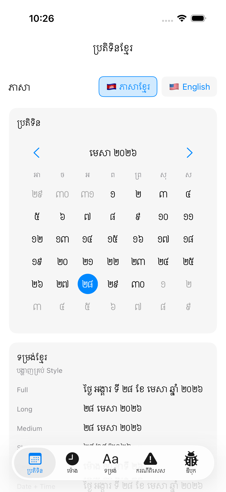
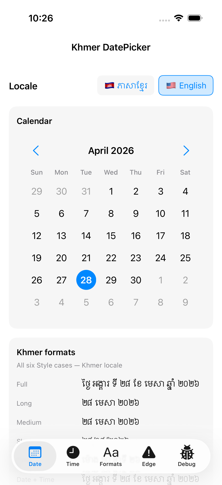
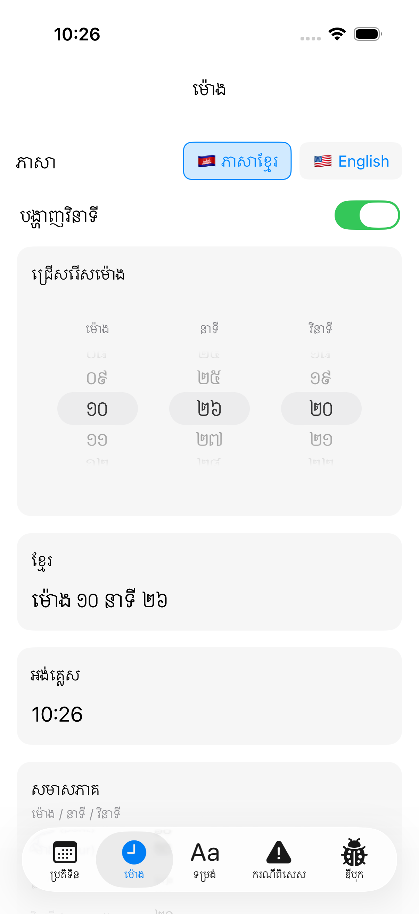
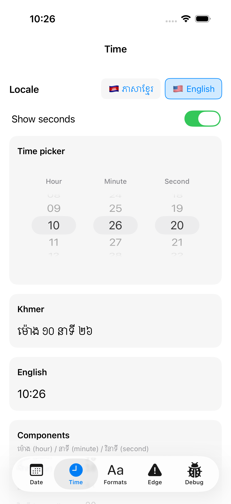
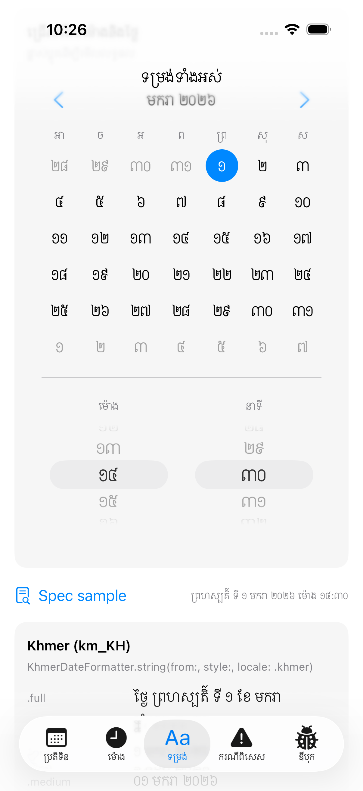
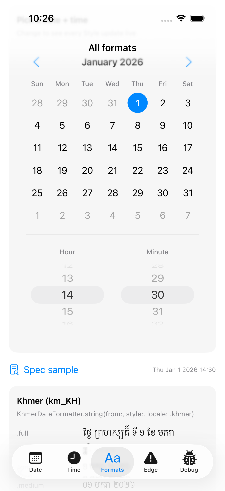
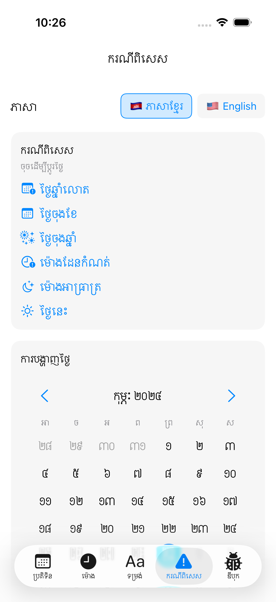
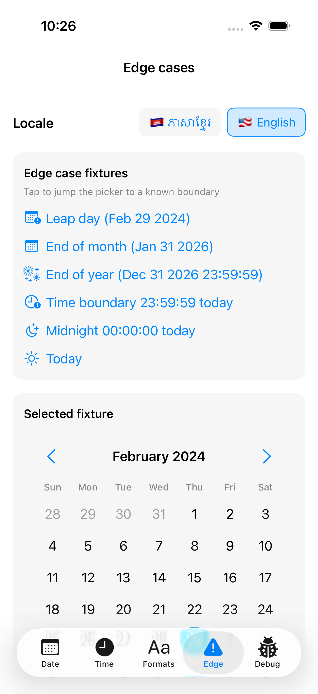
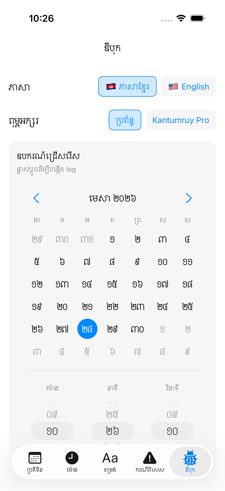
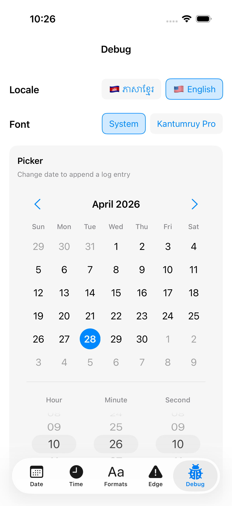

# KhmerDatePicker

**Swift Package developed by [NEMSOTHEA](https://github.com/NemSothea) · Sponsored by [KOSIGN (Cambodia) Investment Co., Ltd.](https://kosign.com.kh/)**

A reusable, **MVVM-clean SwiftUI DatePicker** with full Khmer (ខ្មែរ) localization — Khmer numerals (០–៩), Khmer month names (មករា–ធ្នូ), Khmer weekday names (ច័ន្ទ–អាទិត្យ), and Khmer time labels (ម៉ោង / នាទី / វិនាទី). Switch between Khmer and English at runtime with a single binding.

```
ថ្ងៃ ច័ន្ទ ទី ១ ខែ មករា ឆ្នាំ ២០២៦
```

---

## 🇰🇭 Developed by NEMSOTHEA · Sponsored by KOSIGN

> **KhmerDatePicker is designed and developed by [NEMSOTHEA](https://github.com/NemSothea), and proudly sponsored by [KOSIGN (Cambodia) Investment Co., Ltd.](https://kosign.com.kh/)** — a Cambodian software-engineering company investing in open-source tooling for the Khmer developer community.
>
> NEMSOTHEA leads the architecture, implementation, testing, and long-term maintenance of this package. KOSIGN's sponsorship funds the engineering time, design, and roadmap so that every Cambodian iOS team can ship date-and-time UI in their own language without rewriting it from scratch.
>
> អភិវឌ្ឍដោយ **NEMSOTHEA** · ឧបត្ថម្ភដោយ **KOSIGN (Cambodia) Investment Co., Ltd.**

If your organization would like to support KhmerDatePicker (additional locales, Buddhist-Era calendar, accessibility, CI hardening), please reach out — see the contact details under [Sponsors & contributing](#sponsors--contributing).

---

## Features

- SwiftUI component, public API mirrors Apple's `DatePicker`
- Three modes: `.date`, `.time`, `.dateAndTime`
- Khmer ↔ English locale switch at runtime
- Six built-in date format styles (`.full`, `.long`, `.medium`, `.short`, `.time`, `.dateTime`)
- Configurable first-weekday (Sunday or Monday)
- Optional `in: ClosedRange<Date>` to constrain selectable dates
- Optional seconds picker
- Full VoiceOver labels and Dynamic Type scaling out of the box
- Bundled **Kantumruy Pro** Khmer font (SIL OFL 1.1), opt-in via `.khmerFont(.kantumruyPro)`
- Pure Foundation + SwiftUI — zero third-party dependencies

## Installation

### Xcode

1. **File → Add Package Dependencies…**
2. Enter the repo URL.
3. Add `KhmerDatePicker` to your app target.

### `Package.swift`

```swift
dependencies: [
    .package(url: "https://github.com/NemSothea/KhmerDatePicker.git", from: "1.0.0")
],
targets: [
    .target(
        name: "YourApp",
        dependencies: [
            .product(name: "KhmerDatePicker", package: "KhmerDatePicker")
        ]
    )
]
```

## Quick start

```swift
import SwiftUI
import KhmerDatePicker

struct MyView: View {
    @State private var date = Date()

    var body: some View {
        KhmerDatePickerView(selection: $date)
    }
}
```

## Screenshots

Captured from the demo app at `Examples/KhmerDatePickerDemoApp/` running on iPhone 17 (iOS 26.4).

| Khmer | English |
|---|---|
|  |  |
|  |  |
|  |  |
|  |  |
|  |  |

To regenerate after a UI change, run `ScreenshotCaptureUITests` (gated behind `CAPTURE_SCREENSHOTS=1` so it doesn't slow normal CI):

```bash
cd Examples/KhmerDatePickerDemoApp
SIMCTL_CHILD_CAPTURE_SCREENSHOTS=1 xcodebuild test \
  -project KhmerDatePickerDemoApp.xcodeproj \
  -scheme KhmerDatePickerDemoApp \
  -destination 'platform=iOS Simulator,name=iPhone 17,OS=26.4' \
  -only-testing:KhmerDatePickerDemoAppUITests/ScreenshotCaptureUITests \
  -derivedDataPath .build
xcrun xcresulttool export attachments \
  --path .build/Logs/Test/Test-*.xcresult \
  --output-path /tmp/khmer-shots-export
```

Then rename the exported PNGs (the manifest lists each `suggestedHumanReadableName` like `01-date-km_0_<UUID>.png` → strip the `_0_<UUID>` suffix and copy to `docs/screenshots/`).

## All three modes

```swift
KhmerDatePickerView(selection: $date, mode: .date)
KhmerDatePickerView(selection: $date, mode: .time, showsSeconds: true)
KhmerDatePickerView(selection: $date, mode: .dateAndTime)
```

## Constraining the selectable range

Pass a `ClosedRange<Date>` via `in:` to restrict which dates the user can pick. Days outside the range are visually dimmed and not tappable; the previous/next-month chevrons disable when the adjacent month is fully out of range; the time wheel clamps any value that would push the selection past the bounds.

```swift
let today = Calendar.current.startOfDay(for: Date())
let oneYear = Calendar.current.date(byAdding: .year, value: 1, to: today)!

KhmerDatePickerView(
    selection: $date,
    in: today...oneYear,        // pickable range
    mode: .date
)
```

The initial `selection` is clamped into the range automatically, so there is no need for the caller to validate it first.

## Accessibility

Every day cell exposes a fully-formatted VoiceOver label (e.g. *"ថ្ងៃ ច័ន្ទ ទី ១ ខែ មករា ឆ្នាំ ២០២៦"*), the selected day announces with the `isSelected` trait, and the month-name header is marked as a heading. The hour/minute/second wheels each carry an English VoiceOver label so assistive-tech users can identify the column regardless of the visible locale. All Khmer text scales with **Dynamic Type** by default — pass `relativeTo: nil` to `Font.khmer(_:size:)` if you need a fixed size.

## Switching locale at runtime

```swift
@State private var locale: KhmerLocale = .khmer

var body: some View {
    VStack {
        Picker("Locale", selection: $locale) {
            ForEach(KhmerLocale.allCases, id: \.self) { value in
                Text(value.displayName).tag(value)
            }
        }
        .pickerStyle(.segmented)

        KhmerDatePickerView(selection: $date, locale: locale)
    }
}
```

The picker re-renders all weekday/month/numeral text whenever `locale` changes.

## Khmer font

The package ships **Kantumruy Pro** (a modern, screen-optimised Khmer UI font by Danh Hong, licensed under SIL OFL 1.1). It is **not** applied by default — you opt in with the `.khmerFont(_:)` modifier:

```swift
KhmerDatePickerView(selection: $date)
    .khmerFont(.kantumruyPro)
```

Three options are available:

```swift
public enum KhmerFont {
    case system                    // default — uses iOS's built-in Khmer Sangam MN
    case kantumruyPro              // bundled with the package
    case custom(name: String)      // any PostScript name registered by your app
}
```

For a font your app already ships (for example Noto Sans Khmer), pass its PostScript name:

```swift
KhmerDatePickerView(selection: $date)
    .khmerFont(.custom(name: "NotoSansKhmer-Regular"))
```

Bundled fonts are registered with CoreText lazily on first use — there is no `Info.plist` configuration to add. The OFL license ships at `Sources/KhmerDatePicker/Resources/Fonts/OFL.txt` to satisfy the OFL's redistribution clause.

## Custom formatting

`KhmerDateFormatter` produces strings independently of the picker view.

```swift
let label = KhmerDateFormatter.string(
    from: date,
    style: .full,
    locale: .khmer
)
// → "ថ្ងៃ ច័ន្ទ ទី ១ ខែ មករា ឆ្នាំ ២០២៦"
```

| Style       | Khmer                                                  | English                          |
|-------------|--------------------------------------------------------|----------------------------------|
| `.full`     | `ថ្ងៃ ច័ន្ទ ទី ១ ខែ មករា ឆ្នាំ ២០២៦`                          | `Monday, January 1, 2026`        |
| `.long`     | `១ មករា ២០២៦`                                            | `1 January 2026`                 |
| `.medium`   | `០១ មករា ២០២៦`                                          | `01 Jan 2026`                    |
| `.short`    | `០១/០១/២០២៦`                                             | `01/01/2026`                     |
| `.time`     | `ម៉ោង ១៤ នាទី ៣០`                                        | `14:30`                          |
| `.dateTime` | `ថ្ងៃ ច័ន្ទ ទី ១ ខែ មករា ឆ្នាំ ២០២៦ ម៉ោង ១៤ នាទី ៣០`                | `Monday, January 1, 2026 14:30`  |

## Numeral conversion

```swift
KhmerNumerals.toKhmer("2026")   // → "២០២៦"
KhmerNumerals.toKhmer(7)        // → "៧"
KhmerNumerals.toArabic("២០២៦")  // → "2026"
KhmerNumerals.render(7, in: .khmer, paddedTo: 2) // → "០៧"
```

## Architecture

```
┌──────────────────────────────────────┐
│  Views (SwiftUI)                     │
│   KhmerDatePickerView (root)         │
│   ├ KhmerMonthYearSelectorView       │
│   ├ KhmerCalendarGridView            │
│   └ KhmerTimePickerView              │
└──────────────────────────────────────┘
                  ▲
                  │ @ObservedObject
                  ▼
┌──────────────────────────────────────┐
│  ViewModel                           │
│   KhmerDatePickerViewModel           │
│    @Published selectedDate / locale  │
│    dayCells, monthLabel, weekdayHdr  │
└──────────────────────────────────────┘
                  │
                  ▼
┌──────────────────────────────────────┐
│  Localization (pure values)          │
│   KhmerLocale                        │
│   KhmerNumerals                      │
│   KhmerCalendarSymbols               │
│   KhmerDateFormatter                 │
└──────────────────────────────────────┘
```

Views never compute calendar math — they read derived state from the view model. Localization types are stateless namespaces; `KhmerDateFormatter` is a `struct` with `static func string(from:style:locale:)`.

## Extensibility

### Add a new format style

Add a case to `KhmerDateFormatter.Style`, then handle it in both `khmerString(from:style:)` and `englishString(from:style:)`.

### Add a third locale (e.g. Buddhist Era)

Add a case to `KhmerLocale`, define its `identifier` / `displayName`, and extend the `switch` in `KhmerDateFormatter.string(from:style:locale:)`. `KhmerNumerals.render(_:in:paddedTo:)` and `KhmerCalendarSymbols.month(at:locale:)` likewise switch on the locale — extend them too.

### Custom theme

The picker uses the SwiftUI environment `Color.accentColor` for selected-day fill. Wrap it in `.accentColor(.green)` (or `.tint(...)` on iOS 15+) to recolor.

## Why iOS 14, not iOS 13?

`@StateObject` (iOS 14), `LazyVGrid` (iOS 14), and `.onChange(of:)` (iOS 14) collapse what would otherwise be ~150 lines of manual layout and `ObservableObject` plumbing into idiomatic SwiftUI. iOS 14 is also the practical floor for new SwiftUI apps in 2026 — &lt;1% of active devices are below it. If you really need iOS 13, the localization layer (`KhmerNumerals`, `KhmerCalendarSymbols`, `KhmerDateFormatter`) is iOS 13-clean — fork the views and substitute `@ObservedObject` + manual `HStack` rows.

## Running the demo app

A full SwiftUI demo lives at `Examples/KhmerDatePickerDemoApp/`. It exercises every mode, locale, format style, and edge case the package supports, plus a Debug screen used to capture the README screenshots.

```bash
cd Examples/KhmerDatePickerDemoApp
open KhmerDatePickerDemoApp.xcodeproj
```

Build and run on any iOS 14+ simulator or device. The demo depends on the package via a local SPM reference, so changes to `Sources/` are picked up immediately.

## Tests

```bash
swift test
```

Covers numeral conversion (Arabic ↔ Khmer, padding, mixed strings) and date formatting (every `Style` for both locales).

## Sponsors & contributing

### Author / maintainer

**NEMSOTHEA** ([@NemSothea](https://github.com/NemSothea)) — original author, architect, and ongoing maintainer. All issues, PRs, and roadmap decisions land here first.

### Primary sponsor

**KOSIGN (Cambodia) Investment Co., Ltd.** — primary sponsor. KOSIGN is a Cambodian software-engineering firm investing in open-source tooling for the Khmer developer community; their sponsorship funds NEMSOTHEA's time on this package.

- 🌐 [kosign.com.kh](https://kosign.com.kh/)
- 📍 Phnom Penh, Cambodia

### Contributing

Issues and pull requests are welcome. Good first contributions:

- Adding a third locale (Buddhist Era, Lao, Thai)
- Date range / min-max constraints (`in: ClosedRange<Date>`)
- VoiceOver / Dynamic Type polish on the calendar grid and time wheels
- DocC catalog for the public API
- GitHub Actions CI for `swift test` on each push

Before opening a PR, please run `swift test` locally and capture fresh screenshots from the demo app if you change UI.

### Acknowledgments

- **Kantumruy Pro** — bundled Khmer UI font, by Danh Hong / The Kantumruy Pro Project Authors. SIL OFL 1.1.
- The Cambodian iOS developer community — for the years of "why is there no Khmer DatePicker?" that motivated this package.

## License

Released under the [MIT License](LICENSE) — copyright © 2026 Nem Sothea & KOSIGN (Cambodia) Investment Co., Ltd.

The bundled **Kantumruy Pro** font is licensed separately under the **SIL Open Font License 1.1**. The full license text is shipped at `Sources/KhmerDatePicker/Resources/Fonts/OFL.txt`. Copyright 2022 The Kantumruy Pro Project Authors (https://github.com/googlefonts/kantumruy).
